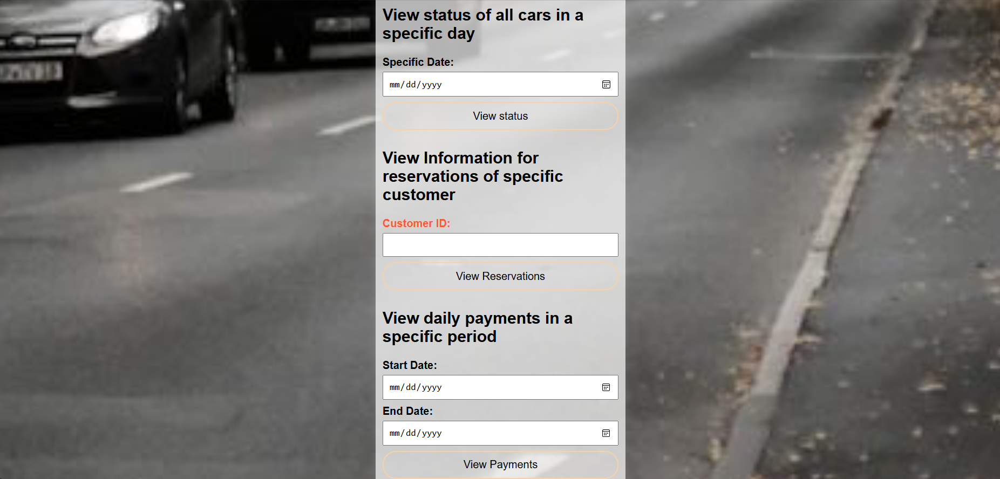
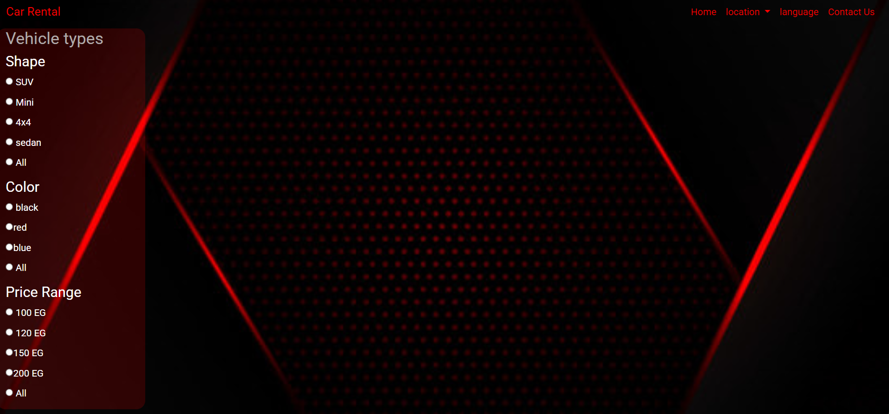

# Car Rental Web Application

A simple web-based car rental management system built with HTML, PHP, and CSS also using bootstrap. This project allows users to register, log in, and rent cars, while providing an admin interface for managing car data.The backend is done with sql using xampp.


## 🚗 Features

- User Registration and Login
- Car Browsing and Renting
- Admin Panel for Managing Cars
- Responsive Design
- Image Gallery for Car Listings

## 📁 Project Structure

rental-car--main/
├── admin.html # Admin login interface
├── admin.php # Admin backend logic
├── car_data.php # Displays car data
├── connect.php # Database connection script
├── home.html # Landing page
├── login.html # User login form
├── login.php # User login backend
├── registration.html # User registration form
├── registration.php # Registration backend logic
├── rental.html # Car rental page
├── rental.css # Main CSS styling
└── images/ # Car and UI images

## 🛠️ Technologies Used

- **Frontend:** HTML, CSS
- **Backend:** PHP
- **Database:** (Assumed MySQL based on `connect.php`)
- **Other:** Static image assets

## 📦 Installation

1. **Clone or Download the Repository**
   ```bash
   git clone https://github.com/your-username/rental-car--main.git
Move to Your Web Server Directory

For XAMPP users: Place the folder inside htdocs.

Start Apache and MySQL via XAMPP/WAMP/etc.

Import the Database

Open phpMyAdmin

Create a new database (e.g., car_rental)

Import the SQL dump (if provided, else you may need to create tables manually based on connect.php)

Update connect.php with your local DB credentials if necessary.

▶️ How to Run
Open your browser and go to:

arduino
Copy
Edit
http://localhost/rental-car--main/home.html
Register or log in as a user to begin renting cars.

Use admin.html for admin access and managing the fleet.

📸 Screenshots
)](image.png)
](image-2.png)
](image-4.png)
📌 Notes
Ensure PHP and MySQL are installed and properly configured.

No external libraries or frameworks are required.

Basic validation is implemented.

👨‍💻 Author
Nabeel Mohamed